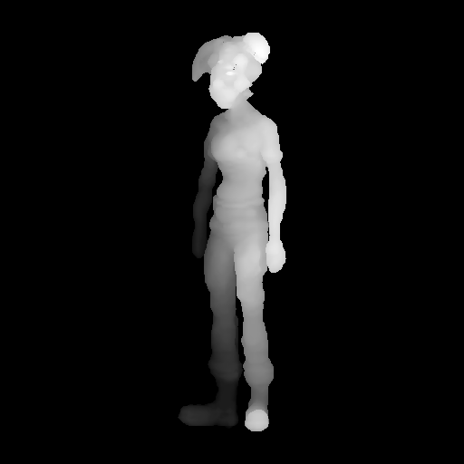
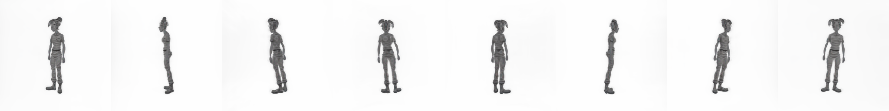
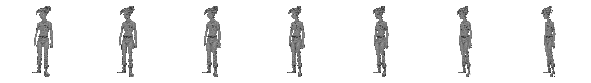

# BENCHMARK.md — TripoSR cost-model gate

**Deliverable for [`AGENTS.md`](../AGENTS.md) §0.** Settles the one unproven number the
whole architecture rests on: *how long does one image take?*

**Date:** 2026-08-26 · **Hardware:** RunPod RTX 4090 (24 GB), torch 2.8.0+cu128, CUDA 12.8,
Python 3.12 · **Input:** `alice_char2.png` (char2 — the clean, neutral-stance case from
REANGLE_PIPELINE.md §4.1) · **Cost of running this benchmark: $0.65.**

---

## DECISION: 🟢 GREEN

TripoSR is **~340× faster than the DrawingSpinUp prototype end-to-end** (1.78 s vs ~8–10 min)
and its mesh gives **proper object relief**, not the scene-depth gradient that killed
monocular depth (§4.4). Commit to the serverless architecture and build `ReangleTool` on
TripoSR.

The §0 gate was *"warm ≲ ~30 s/image **and** mesh quality ≈ DrawingSpinUp"*. Measured warm
is **1.78 s** — 17× inside the threshold — with quality that clears the bar (§2 below).

---

## 1. Measured latency

Steady-state warm (median of runs 2–5; run 1 excluded as CUDA warm-up), `mc_resolution=256`:

| Stage | Time | Note |
|---|---:|---|
| matte (isnet, GPU) | 0.367 s | onnxruntime-gpu; **6.44 s on CPU** — see §5 |
| **reconstruct (TripoSR)** | **0.114 s** | ⭐ the key number |
| mesh extract (marching cubes) | 1.410 s | now the dominant stage |
| UV-bake + `.glb` export | 0.027 s | front-planar UV, original art as texture |
| **total warm** | **1.918 s** | 1.782 s at best observed |

**Cold start (model load, weights already on disk):** isnet 0.60 s + TripoSR 13.10 s =
**13.70 s**. Add ~1.8 s for the first request → **~15.5 s worst case cold**.

**Resources:** VRAM peak **4.44 GB** (fits the smallest serverless tier); mesh 14,981 verts /
29,887 faces; `.glb` 728 KB.

### Marching-cubes resolution — the one real cost lever

| `mc_resolution` | extract | **total** | verts | vs. mc=256 |
|---|---:|---:|---:|---|
| 128 | 0.181 s | **0.660 s** | 3,533 | **2.7× cheaper** |
| 192 | 0.591 s | 1.063 s | 8,464 | 1.7× cheaper |
| 256 *(default)* | 1.316 s | 1.782 s | 14,981 | — |
| 320 | 2.914 s | 3.399 s | 24,108 | 1.9× dearer |

Extraction scales ~res³ and is now **74% of wall-clock**. Because the mesh is only a
**depth proxy, not a render** (REANGLE_PIPELINE.md §4.3), dropping to 128/192 is likely free
in perceived quality. **Not yet validated** — see §6.

---

## 2. Quality check — does TripoSR give real object relief?

**Yes.** This is the test monocular depth failed (§4.4), and it is the reason the whole
approach works.



Front-orthographic depth rendered from the TripoSR mesh. The relief is **per-body-part**:
the nose protrudes, the chest is rounded, both arms and hands sit clearly nearer than the
torso, the legs separate in depth, the boots come forward. Contrast Depth-Anything-V2, which
produced a global head-near/feet-far ramp and *sheared* the figure instead of turning it.



Full 360° orbit: coherent character, correctly **thin** side profiles, a real back, limbs
intact. Comparable to the DrawingSpinUp result on char2 — at 0.114 s instead of ~8–10 min.

**Better than parity on back-surface inference.** TripoSR infers *plausible* unseen geometry —
the back arch and glute shape are present and anatomically sensible, where the Wonder3D+NeuS
prototype gave a vaguer guess. This matters beyond aesthetics: the style window in §7.4 closes
when the proxy's **guessed sides** start showing, so a better-inferred back **widens the usable
angle range** before the artist has to back off. Recorded as an upgrade over the prototype,
not merely a speed win.

### The art actually projects



The artist's original art front-projected onto the proxy, orbiting −18° → +18°
(`scripts/preview_reangle.py`). Shirt graphic, belt, boot creases and linework are the
original pixels — style preserved by construction. Softening at the extremities and
mirror-smear on back faces are the expected cost of the front-planar bake (§7.5 "simplest");
xatlas + disocclusion inpainting (§9) is the fix when a wider window is wanted.

**Quantified alignment** (`scripts/benchmark/depthcheck.py`):

| Metric | Value | Meaning |
|---|---:|---|
| silhouette IoU vs. artist's matte | **0.776** | next-best axis 0.600 — decisive |
| front axis | **+X** | *not* Z — TripoSR convention, see §5 |
| relief spread (p05–p95) | 0.768 | substantial front-back depth range |
| relief std | 0.252 | not a flat card |

The 0.776 IoU matters beyond the gate: Stage 2 needs depth **pixel-aligned to `texture.png`**,
and this confirms the mesh's front projection lands on the artist's silhouette.

---

## 2b. End-to-end validation of the real API (2026-08-26)

The numbers above measure the *pipeline*. This section measures the **shipped
`POST /tools/reangle` endpoint**, authenticated, on an RTX 4090 — the thing Inkternity
will actually call.

**Steady state over 8 distinct requests** (the PNG is re-encoded per request so the input
hash differs and the cache always misses, while the work stays identical):

| | HTTP round trip | server-side total | matte | reconstruct+extract | uv-bake |
|---|---:|---:|---:|---:|---:|
| first call | 2.57 s | 2.52 s | 0.74 s | 1.61 s | 0.16 s |
| **steady (median)** | **1.72 s** | **1.69 s** | **0.30 s** | **1.23 s** | **0.16 s** |

- **HTTP overhead is ~0.03 s** — negligible against the GPU work.
- **Cache HIT: 0.014 s**, byte-identical `.glb` (sha256 verified). That is **~120× faster**
  than a miss and is the common path, since it is one call per drawing.
- `mc_resolution=128` end to end: 1.87 s first, 225 KB `.glb` (vs 729 KB at 256).
- **Startup warm-up confirmed**: `warmed models: {'isnet': 0.63, 'triposr': 15.07}` — no
  request pays the load cost.
- **The tool rediscovered the front axis on its own**: `depth=axis0 sign=+1 IoU=0.772`,
  independently reproducing §2's 0.776. Axis detection is not hard-coded anywhere.

`uvbake` is 0.16 s here versus 0.027 s in §1 — the extra ~0.13 s is the six-candidate
front-axis detection. That is a deliberate trade: ~8% of request time to make the bake
correct under a backbone swap rather than silently wrong.

Auth behaved as specified: `401` with no key, `401` with a wrong key, `401` on `GET /tools`,
`200` with either `X-API-Key` or `Authorization: Bearer`, and `/healthz` open for probes.

### Three bugs this caught that unit tests did not

All three passed 57 unit tests and would have shipped:

1. **Startup warm-up never ran.** Loaders were registered inside `run()`, so
   `models.warm()` raised `KeyError` at startup and every model loaded on the *first
   request* — the first user eating ~15 s. Fixed by declaring loaders via
   `Tool.model_loaders()`, registered when the app is built. Regression-tested.
2. **Application logging vanished under uvicorn.** `basicConfig` lived in `main()`, which
   `uvicorn ...:create_app --factory` never calls — so request timings, cache hit/miss, the
   front-view IoU, and the *"auth is DISABLED"* warning were all invisible in the exact
   configuration a deploy uses. Fixed by `configure_logging()` in `create_app`.
3. **An unhelpful error message cost real time.** "TripoSR not importable — set
   TRIPOSR_PATH" sent me hunting a path problem when the cause was a missing transitive
   dependency several imports deep. Now reports the actual missing module.

### Dependency trap: `rembg` re-breaks GPU matting

TripoSR imports `rembg` at module scope (we do not use it — we matte with isnet). **`rembg`
depends on CPU `onnxruntime`**, which shadows `onnxruntime-gpu` and silently returns the
matte to CPU: **6.4 s instead of 0.03 s**, with no error. Any Dockerfile must install
`rembg` *first* and then re-assert `onnxruntime-gpu`, verifying
`get_providers()` contains `CUDAExecutionProvider`. This is gotcha §5.3 biting a second
time through a transitive dependency, so treat the provider check as a **build-time
assertion**, not a one-off fix.

---

## 3. Cost model

RunPod **Serverless** pricing, fetched 2026-08-26 from runpod.io/pricing (billed per-second
while running; **~$0 idle**):

| Tier | $/hr | $/sec |
|---|---:|---:|
| **RTX 4090 (24 GB)** — benchmarked | $1.10 | $0.000306 |
| L4 / A5000 / 3090 (24 GB) | $0.69 | $0.000192 |
| A6000 / A40 (48 GB) | $1.22 | $0.000339 |
| L40 / L40S (48 GB) | $1.75 | $0.000486 |

4.44 GB peak VRAM means **the cheapest 24 GB tier is sufficient** — no need to pay for 48 GB.

**Per image, warm, on a 4090:**

| Config | Time | $/image |
|---|---:|---:|
| mc=256 | 1.78 s | **$0.00054** |
| mc=192 | 1.06 s | $0.00033 |
| mc=128 | 0.66 s | **$0.00020** |
| every request cold (worst case) | 15.5 s | $0.0047 |

**Monthly**, mc=256 warm — one request per *drawing*, mesh cached by input hash, all
subsequent interaction local in Inkternity:

| Drawings/mo | Warm | If every request were cold |
|---|---:|---:|
| 1,000 | **$0.55** | $4.73 |
| 10,000 | $5.45 | $47.30 |
| 100,000 | $54.50 | $473 |

**Against the alternatives:**

| Backbone | Time/image | $/image | vs. AGENTS.md §0 estimate |
|---|---:|---:|---|
| DrawingSpinUp (prototype) | ~8–10 min | $0.147–0.183 | est. $0.12–0.25 ✓ |
| **TripoSR (measured)** | **1.78 s** | **$0.00054** | est. $0.005–0.02 — **10–37× better** |

A persistent 24 GB box is ~$350–580/mo. Serverless at 1,000 drawings/mo costs **$0.55** —
roughly **1/700th**. The scale-to-zero architecture is comfortably justified.

---

## 4. Licensing — the productization win

This also clears the blocker in REANGLE_PIPELINE.md §8. The prototype's **Wonder3D weights
are CC-BY-NC → research/demo only**. The benchmarked stack is shippable:

| Component | License |
|---|---|
| TripoSR (model + code) | **MIT** |
| isnet (`isnet_dis.onnx`) | permissive |
| torchmcubes, trimesh, onnxruntime | MIT / Apache-2.0 |

**No CC-BY-NC anywhere.** tiny-cuda-nn, NeuS, Wonder3D and pytorch3d are all dropped —
the §5 environment recipe collapses to `torch + transformers + TripoSR + onnxruntime`.

---

## 5. Gotchas (encode these in the Dockerfile)

Each of these cost real time; all are one-line fixes:

1. **`transformers` must be `<5`.** v5 renamed ViT weights
   (`encoder.layer.N.attention.attention.query` → `layers.N.attention.q_proj`), so the
   TripoSR checkpoint fails `load_state_dict` with a wall of missing keys. Pinned **4.49.0**.
2. **`onnxruntime-gpu` must match the CUDA major.** 1.29.0 is built for **CUDA 13** and
   silently falls back to CPU on a CUDA 12 box — which made the matte **6.44 s instead of
   0.027 s (242×)**. Pinned **1.22.0**, with torch's bundled cuDNN 9 on `LD_LIBRARY_PATH`.
3. **Never install `onnxruntime` and `onnxruntime-gpu` together** — the CPU package shadows
   the GPU one.
4. **`torchmcubes` needs `scikit-build-core` + `--no-build-isolation`** (so it sees torch).
   Needs nvcc; set `TORCH_CUDA_ARCH_LIST` for the target arch (8.9 = Ada/4090).
5. **TripoSR's front axis is +X, not +Z.** The front-facing image plane is therefore
   **(Y, Z) with X as depth**. This is not a footnote — the benchmark's own
   `frontplanar_glb()` assumed `(X, Y)` and so baked the art onto the mesh **from the side**.
   The timing was unaffected (identical cost either way) but `char.glb`'s texture mapping was
   wrong until corrected. `scripts/benchmark/depthcheck.py` detects the axis empirically by
   silhouette IoU rather than assuming it; `ReangleTool` must do the same, since the
   convention is TripoSR's and could change with a backbone swap.
6. **The UV fit must match `prep_input.py` exactly** — aspect-preserving, 8% margin, centred.
   Any mismatch and the art slides off the silhouette even with the right axis.

### RunPod operational notes
- Requesting `supportPublicIp: true` + explicit `22/tcp` makes **every** GPU tier report
  *"no instances currently available"*. Omit them and pods provision immediately.
- Container disk must exceed the **unpacked** image (11.7 GB compressed here). Undersized
  disk stalls forever with **no error** — `runtime` just stays `null`.
- Without a public IP, proxy SSH (`ssh.runpod.io`) gives an **interactive shell and ignores
  the remote command argument**; commands must go over stdin (`stty -echo` to stop the PTY
  echoing them back). No scp — `scripts/benchmark/podsend.sh` / `podrecv.sh` do sha-verified
  base64 transfer over that channel.

---

## 6. What this did NOT measure

Stated plainly so nobody reads more into the GREEN than it earns:

- **Only one character (char2).** REANGLE_PIPELINE.md §4.1 establishes that **pose is the
  constraint** — char1's outstretched arm and frilly skirt collapsed *DrawingSpinUp's* mesh.
  **TripoSR was not tested against that hard case.** It may fail identically (the pose rule
  would then simply carry over) or do better. Worth one run before §4.1 is restated as a
  TripoSR-era feature rule.
- ~~**Serverless container cold-start**~~ — **now measured against the live endpoint**;
  see §6b. The 13.70 s here remains *model load only*, excluding container start.
- **Lower `mc_resolution` quality.** The 2.7× saving at mc=128 is measured; whether the
  coarser mesh degrades the *depth proxy* is not. Cheap to check with `depthcheck.py`'s
  relief metrics.
- **The real UV bake.** Timed the front-planar bake (§7.5 "simplest"). The xatlas unwrap +
  disocclusion inpainting path (§9) will cost more.
- **End-to-end reangle quality** — no depth-warp/orbit-bake was run against the prototype's
  output for side-by-side comparison.

---

## 6b. Measured on the live serverless endpoint

Endpoint `69j3vhp0el0wv0` (RTX 4090 / L4, EU-RO-1, `workersMin=0`, `idleTimeout=10 s`,
FlashBoot on), reached through the authenticating proxy with a real scoped key.
Input: `alice_char2.png`, 556 KB.

| Request | `X-Cache` | Upstream | Wall |
|---|---|---|---|
| Cold start — fresh worker, must pull the 6.48 GB image | HIT | 0.027 s | **260.5 s** |
| Cold start — host already had the image cached | HIT | 0.014 s | 47.6 s |
| Warm, genuine cache miss (`mc=192`) | MISS | **1.994 s** | 6.9 s |
| Warm, cache hit | HIT | 0.008–0.027 s | 4.5–4.8 s |

**The 1.994 s miss confirms the §2 projection** (1.918 s predicted steady state) on
real serverless hardware rather than a rented pod.

**Cold start is ~4.4 minutes, not seconds.** This is the number §6 flagged as
unmeasured, and it is worse than the model-load figure suggests: nearly all of it
is pulling 6.48 GB of image, of which a single torch+CUDA layer is 3.96 GB. When
the host already holds the image it drops to ~48 s. FlashBoot does not help the
first pull onto a given host.

**The wall-clock column is not the deployment's latency.** These were measured
with the proxy on a laptop, so every request paid that laptop's uplink for
745 KB of base64 up and ~590 KB down — about 340 KB/s here, which is the whole
~4.6 s floor on cache hits (RunPod's own API RTT measures ~0.7 s). A proxy on a
VPS near the endpoint removes it; the client then pays only client→proxy.

**The network volume works.** `hvym-img-cache` (10 GB, EU-RO-1) is mounted at
`/runpod-volume` with `HVYM_CACHE_DIR=/runpod-volume/cache`. After the endpoint
scaled to zero and a *fresh* worker started, the same cache key still returned
`X-Cache: HIT` — a per-worker cache would have missed. Cost is $0.07/GB/mo, so
**$0.70/mo**, which now exceeds the compute ($0.55/mo at 1,000 drawings); total
~$1.25/mo.

### The bug this found

`/runsync` does not block until a job finishes — RunPod caps it at ~90 s and
returns the job still `IN_QUEUE`. The proxy treated any non-`COMPLETED` status as
failure, so **the first request after every scale-to-zero returned 502**, and
scale-to-zero is the entire cost model. The work had actually completed on the
worker; only the proxy's reading of the reply was wrong. Fixed by polling
`/status/{id}`. The mocked upstream could not have caught it — it always answered
`COMPLETED` on the first call.

---

## 6c. Generative texturing evaluated and rejected

Paint3D and MVPaint were tested as a possible replacement for (or supplement to)
the front-projection. **Neither is adopted.** MVPaint ships with no license at
all; Paint3D is cleanly Apache-2.0 but regenerates the character rather than
moving it, and its UV inpainter turns our marching-cubes atlas into grey mush.
It also costs ~56 s of GPU against the pipeline's 1.9 s.

Full write-up and images: [`benchmark/paint3d/FINDINGS.md`](benchmark/paint3d/FINDINGS.md).

---

## 6d. TRELLIS as reangle's backbone — measured

**The swap shipped in reangle 0.3.0.** Every number here comes from baking the
same character drawing through the same pipeline, scoring the *delivered* `.glb`
by splatting its UVs back onto the isnet matte. TRELLIS meshes came from the live
`/tools/mesh` endpoint; the bake and scoring ran locally through
`scripts/trellis_reangle_probe.py`.

| mesh | faces | silhouette IoU | best case ¹ | width ÷ height |
|---|---|---|---|---|
| **TripoSR** | 29,887 | **0.772** | 0.857 | 0.271 |
| **TRELLIS**, 20k | 20,000 | **0.675** | 0.738 | 0.296 |
| TRELLIS, undecimated | 176,724 | 0.674 | — | 0.296 |
| TRELLIS, fed the isnet matte | 20,000 | 0.665 | — | 0.299 |

¹ after a scale/offset search — i.e. the most any pure reframing could recover.

**The number favours TripoSR; the picture favours TRELLIS.** TripoSR tears: its
ponytail smears into a wedge at every angle, its arm boundaries come back ragged,
and the face degrades badly by +20°. TRELLIS returns coherent hair and intact
limbs, at the cost of a smear under the chin at +20°.

IoU measures whether the outline matches. It does not measure whether the mesh is
*intact*, and a torn mesh is what produces the smears an artist actually sees.
That is why the swap went ahead on a 12.6% worse score.

### Three explanations for the gap, all tested and discarded

1. **Detached fragments inflating the bounding box.** TRELLIS returns 8 components
   to TripoSR's 3. Keeping only the largest (95.96% of faces) moved IoU
   0.6748 → 0.6744. Nothing.
2. **Framing.** A scale/offset search lifts both (0.738 / 0.857). The ranking does
   not change, and TRELLIS's *ceiling* stays below TripoSR's shipping score.
3. **A different silhouette.** Feeding TRELLIS the isnet matte instead of the raw
   drawing scored 0.6647 — marginally worse. The input-convention fix
   (backbones/__init__.py) is still correct; it does not buy alignment.

The cause is proportion: TRELLIS builds a fuller body than the drawn figure. That
shows up as a one-sided halo down the flank, not as misplaced art.

### Settled along the way

- **Decimation is free.** 176,724 → 20,000 faces costs 0.001 IoU, and the
  delivered `.glb` is *smaller* than TripoSR's (490 KB vs 703 KB).
- **Front detection is genuinely backbone-agnostic.** It found TRELLIS's own
  convention unprompted — depth on **Y** (plane X,Z) where TripoSR is depth on
  **X** (plane Y,Z). No hard-coding was needed, which is exactly why §5.5 built
  it that way.
- **Untested lever.** `fit_to_frame` normalises by the *mesh's* bounding box.
  Fitting to the *matte's* silhouette box would align width and height
  independently and the scale search suggests most of the gap is reachable —
  but §5.6 records per-axis normalisation destroying alignment once before, so
  it needs measuring rather than assuming.

## 7. Reproducing

```sh
# scripts/benchmark/ — setup.sh installs the light env (no tcnn / NeuS / Wonder3D)
bash setup.sh                      # + the §5 pins
python bench.py   --out out --warm-runs 5 --mc-resolution 256
python depthcheck.py               # front-axis detection + relief metrics
```

Raw numbers: [`benchmark/bench.json`](benchmark/bench.json). Artifacts:
[`benchmark/front_depth.png`](benchmark/front_depth.png),
[`benchmark/orbit_strip.png`](benchmark/orbit_strip.png),
[`benchmark/matte_texture.png`](benchmark/matte_texture.png).

---

## 8. What this unblocks

Per AGENTS.md §11, the gate is passed — roadmap steps 1–3 are live:

1. **Scaffold core** — `Tool` ABC, registry, server, ModelCache, cache, imageio.
2. **`ReangleTool` on TripoSR** — the pipeline is now `matte → TripoSR → front-planar UV
   bake → glb`, ~1.8 s warm, cached by input hash.
3. **Dockerfile + serverless deploy** — a *light* MIT-only image; bake weights in to keep
   cold start near the measured 13.7 s.

The async job form contemplated in AGENTS.md §8 (`202 + job id`) is **not needed for
reangle**: 1.8 s warm fits a synchronous request comfortably. Cold start (~15 s) is the only
case that might warrant it.
